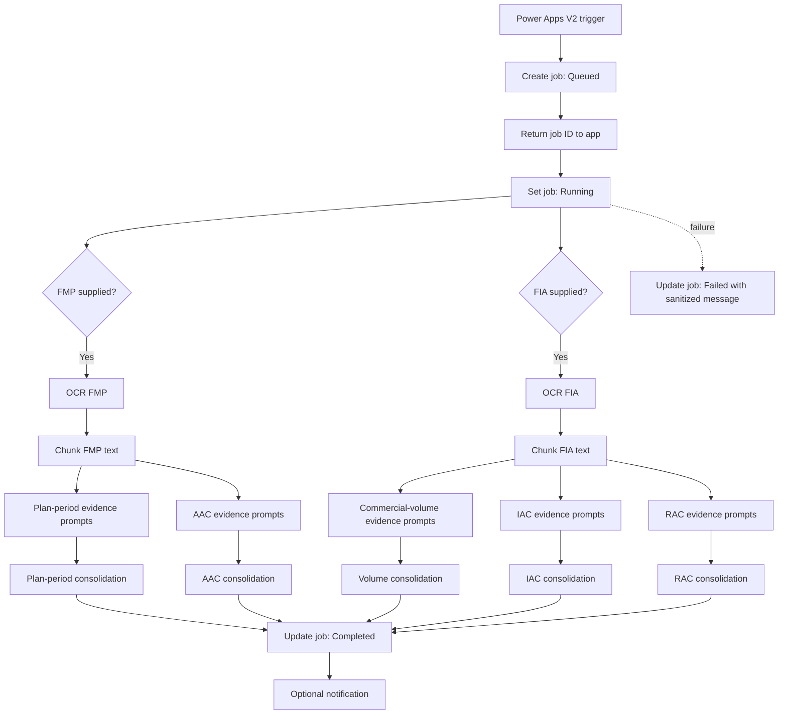

# Public-Safe Flow Build Guide

> **Purpose:** This guide documents the cloud-flow design in enough detail to explain and reproduce the pattern with synthetic data. It intentionally omits production identifiers, connection names, internal URLs, raw export JSON, and deployment-only configuration.

## What is being built

A Power Apps-triggered Power Automate flow that:

1. accepts an FMP PDF, an FIA PDF, or both;
2. creates a processing-job record and immediately returns a job ID to the app;
3. uses AI Builder text recognition to extract text;
4. splits long text into overlapping chunks;
5. runs metric-specific evidence prompts on each chunk;
6. runs final consolidation prompts for each metric;
7. writes the candidate results to the job record;
8. marks the job complete and optionally sends a notification; and
9. records a sanitized failed state when processing does not succeed.



## Components

| Component | Public role |
|---|---|
| Power Apps V2 trigger | Receives files and basic metadata from the canvas app |
| SharePoint or equivalent job store | Holds status, timestamps, and candidate result text |
| AI Builder text recognition | Converts each PDF into text |
| AI Builder custom prompts | Finds evidence and consolidates metric results |
| Microsoft 365 notification | Optionally tells the requester that processing is complete |
| Power BI | Separate read-only comparison surface in the application |

## Input contract

Create these trigger inputs with generic names:

| Input | Type | Purpose |
|---|---|---|
| `hasFMP` | Boolean | Indicates whether an FMP file should be processed |
| `hasFIA` | Boolean | Indicates whether an FIA file should be processed |
| `fmpFile` | File | Optional FMP PDF |
| `fiaFile` | File | Optional FIA PDF |
| `organizationName` | Text | Used only for a friendly job label; validate and normalize it |
| `requesterEmail` | Text | Optional notification destination; do not hard-code a personal address |

The public design assumes PDF input. Enforce file type and size in both the app and flow.

## Job-record contract

Use a dedicated list or table with least-privilege permissions. Suggested fields:

| Field | Type | Purpose |
|---|---|---|
| `Title` | Text | Friendly job label |
| `JobID` | Text, indexed | Correlation key returned to the app |
| `Status` | Choice/Text | `Queued`, `Running`, `Completed`, or `Failed` |
| `StartedOn` | Date/time | Submission time |
| `CompletedOn` | Date/time | Completion time |
| `Error` | Multiple lines | Sanitized support message only |
| `PlanPeriod` | Multiple lines | Candidate FMP plan-period result |
| `CommercialVolume` | Multiple lines | Candidate FIA volume result |
| `AAC` | Multiple lines | Candidate AAC result |
| `IAC` | Multiple lines | Candidate IAC result |
| `RAC` | Multiple lines | Candidate RAC result |

Do not store uploaded source documents or full OCR text in a public repository. Retention of operational content must follow the approved records and data-handling rules for the deployment.

## Build sequence

### 1. Add the trigger

Create an **Instant cloud flow** using **Power Apps (V2)**. Add the six inputs from the input contract.

Validate that at least one document flag is true. Do not trust the Boolean alone; also validate the supplied filename, extension, content, and approved size limit.

### 2. Generate a job ID

Add a **Compose** action named `Compose_JobID`.

Public-safe pseudocode:

```text
normalizedName = lower(trim(organizationName))
normalizedName = replace spaces and unsupported characters with hyphens
jobId = normalizedName + "-" + newGuid()
```

Use the GUID only as a correlation component. Do not expose environment or tenant identifiers.

### 3. Create the queued job

Add **Create item** (or equivalent) and write:

```text
Title       = jobId
JobID       = jobId
Status      = Queued
StartedOn   = utcNow()
```

Store the new record's numeric/internal ID in `varJobItemId` for later updates.

### 4. Return control to the app early

Add **Respond to a Power App or flow** immediately after the job is created:

```json
{
  "jobid": "<generated job ID>",
  "accepted": true,
  "message": "Processing started"
}
```

This lets the canvas app navigate to a results screen and poll the job record instead of holding the user interface open for the entire OCR and AI process.

### 5. Initialize variables

Use clear, metric-specific variables. A cleaned public pattern is:

```text
varJobItemId              Integer
varChunkSize              Integer
varOverlap                Integer
varFmpText                String
varFiaText                String
varFmpChunks              Array
varFiaChunks              Array
varPlanPeriodEvidence     Array
varAacEvidence            Array
varVolumeEvidence         Array
varIacEvidence            Array
varRacEvidence            Array
varPlanPeriodResult       String
varAacResult              String
varVolumeResult           String
varIacResult              String
varRacResult              String
```

Keep a **separate evidence array for each metric**. This prevents one metric's evidence from being mixed into another metric's final consolidation prompt.

Choose chunk size and overlap through testing against the selected model limits. Store them as environment variables or documented configuration rather than unexplained magic numbers.

### 6. Add a processing scope

Create a `Scope_Process` and first update the job:

```text
Status = Running
```

Place the FMP and FIA branches inside this scope. Configure concurrency deliberately. Parallel processing can reduce elapsed time, but prompt capacity, connector throttling, order, and shared variables must be considered.

### 7. Build the FMP branch

Add a condition:

```text
hasFMP is true
AND fmpFile.name ends with .pdf
```

Inside the yes branch:

1. Run **Recognize text in an image or document** using the FMP file content.
2. Store the full text in `varFmpText`.
3. Create overlapping chunks and append them to `varFmpChunks`.
4. For each chunk, run the **Plan-period evidence** prompt.
5. Ignore exact `NO PLAN PERIOD EVIDENCE` responses; append qualifying output to `varPlanPeriodEvidence`.
6. For each chunk, run the **AAC evidence** prompt.
7. Ignore exact `NO AAC EVIDENCE` responses; append qualifying output to `varAacEvidence`.
8. Run the plan-period consolidation prompt once using the joined plan-period evidence.
9. Run the AAC consolidation prompt once using the joined AAC evidence.
10. Store those outputs in `varPlanPeriodResult` and `varAacResult`.

If the flag is true but the file is not an approved PDF, set a user-friendly validation result rather than sending the file to OCR.

### 8. Build the FIA branch

Add a condition:

```text
hasFIA is true
AND fiaFile.name ends with .pdf
```

Inside the yes branch:

1. Run text recognition using the FIA file content.
2. Store the full text in `varFiaText`.
3. Create overlapping chunks and append them to `varFiaChunks`.
4. Run the **Commercial-volume evidence** prompt for each chunk and collect qualifying results in `varVolumeEvidence`.
5. Run the **IAC evidence** prompt for each chunk and collect qualifying results in `varIacEvidence`.
6. Run the **RAC evidence** prompt for each chunk and collect qualifying results in `varRacEvidence`.
7. Run one consolidation prompt for each evidence array.
8. Store outputs in `varVolumeResult`, `varIacResult`, and `varRacResult`.

### 9. Chunk the OCR text consistently

Use one chunking method for both documents. Public-safe pseudocode:

```text
step = chunkSize - overlap
chunkCount = ceiling(textLength / step)

for index from 0 to chunkCount - 1:
    start = max(0, index * step)
    length = min(chunkSize, textLength - start)
    chunk = substring(text, start, length)
```

Requirements:

- `overlap` must be smaller than `chunkSize`.
- Avoid zero or negative lengths.
- Use overlap so a label near the end of one chunk and its value near the beginning of the next remain together.
- Test multibyte characters, empty OCR output, very short files, and files near the maximum size.
- Avoid placing full OCR text in normal production logs when it may contain protected information.

### 10. Filter evidence

For each metric, use its exact no-evidence token. Example:

```text
Plan period: NO PLAN PERIOD EVIDENCE
AAC:         NO AAC EVIDENCE
Volume:      NO COMMERCIAL VOLUME EVIDENCE
IAC:         NO IAC EVIDENCE
RAC:         NO RAC EVIDENCE
```

Do not use a broad “contains NO” filter. Exact tokens reduce accidental removal of valid evidence.

Before the final prompt, join only that metric's evidence records with a clear separator such as:

```text
--- EVIDENCE RECORD ---
```

### 11. Update the completed job

After all selected branches succeed, update the job record:

```text
Status            = Completed
CompletedOn       = utcNow()
PlanPeriod        = varPlanPeriodResult
CommercialVolume  = varVolumeResult
AAC               = varAacResult
IAC               = varIacResult
RAC               = varRacResult
Error              = blank
```

The canvas app can retrieve the row by `JobID` and display these fields. Every result should be labeled as AI-assisted and subject to source verification.

### 12. Add failure handling

Create a separate `Scope_Failure` configured to run after `Scope_Process` **has failed, has timed out, or has been skipped unexpectedly**.

Update the job:

```text
Status       = Failed
CompletedOn  = utcNow()
Error        = "Processing could not be completed. Record the job ID and use the approved support channel."
```

Do not write raw connector responses, OCR content, stack traces, internal URLs, or tokens into a user-visible error field.

### 13. Add an optional notification

After the completed update, send a minimal notification through an approved connection:

```text
Subject: Forestry metrics analysis completed
Body: The requested analysis has completed. Open the approved application and use the job ID to review the candidate results.
```

Do not attach source documents or include extracted values unless that use is specifically approved. Validate the recipient instead of relying on a hard-coded personal address.

## Recommended action inventory

| Order | Public action name | Power Automate action |
|---:|---|---|
| 1 | `Trigger_FromPowerApps` | Power Apps (V2) |
| 2 | `Compose_JobID` | Compose |
| 3 | `Create_QueuedJob` | Create item |
| 4 | `Set_JobItemID` | Set variable |
| 5 | `Respond_Accepted` | Respond to a Power App or flow |
| 6 | `Scope_Process` | Scope |
| 6a | `Set_Running` | Update item |
| 6b | `Condition_ProcessFMP` | Condition |
| 6c | `Condition_ProcessFIA` | Condition |
| 6d | `Update_Completed` | Update item |
| 7 | `Scope_Failure` | Scope with failure run-after settings |
| 8 | `Notify_Requester` | Send an email (optional) |

Within each document branch, use descriptive action names such as `OCR_FMP`, `Build_FMP_Chunks`, `Prompt_AAC_Evidence`, and `Prompt_AAC_Final` rather than auto-generated names like `Run_a_prompt_9`.

## Canvas-app polling pattern

After receiving the job ID, the app can poll the job store on a timer:

```text
1. Save returned job ID.
2. Navigate to the Results screen.
3. Every configured interval, look up the job by JobID.
4. If status is Queued or Running, continue waiting.
5. If Completed, stop the timer and display candidate results.
6. If Failed, stop the timer and show the sanitized support message.
7. Stop after an approved timeout and provide a retry/support path.
```

Avoid rapid polling. Use an interval and maximum duration that respect connector limits and expected processing time.

## Security and responsible-AI controls

- Treat uploaded documents and OCR text as untrusted input.
- Test prompt-injection attempts embedded inside documents.
- Use approved connectors and least-privilege service identities.
- Parameterize site, list, report, workspace, and notification settings.
- Keep protected information out of GitHub issues, samples, logs, and screenshots.
- Constrain prompt outputs and sanitize errors.
- Make human review prominent in the app and documentation.
- Preserve traceability through excerpts and page/section hints.
- Use synthetic or approved non-sensitive test fixtures.

## Minimum test matrix

| Scenario | Expected result |
|---|---|
| FMP only | Plan period and AAC are processed; FIA metrics are clearly unavailable |
| FIA only | Volume, IAC, and RAC are processed; FMP metrics are clearly unavailable |
| Both PDFs | All five metric paths run |
| Wrong file type | Processing is blocked with a clear conversion message |
| Oversized PDF | Submission is blocked before OCR |
| Empty OCR output | Job enters a controlled failed or no-evidence state |
| Connector/model outage | Job becomes `Failed` with a sanitized message |
| Conflicting evidence | Final prompt reports uncertainty rather than silently choosing |
| Embedded prompt injection | Document instructions are ignored; extraction rules remain controlling |
| Missing report access | App remains usable and explains the separate access requirement |
| Keyboard/screen reader | Submission, status, results, and error states are understandable |

## What this public guide omits

- Production site, list, environment, tenant, workspace, report, or connection identifiers
- Raw cloud-flow JSON or managed/unmanaged solution files
- Exact production prompt/model record IDs
- Run histories, source documents, OCR text, or real result data
- Organization-specific security, privacy, records, and authorization procedures

For the public-safe prompt templates used by this design, see [`PROMPT_LIBRARY.md`](PROMPT_LIBRARY.md).
