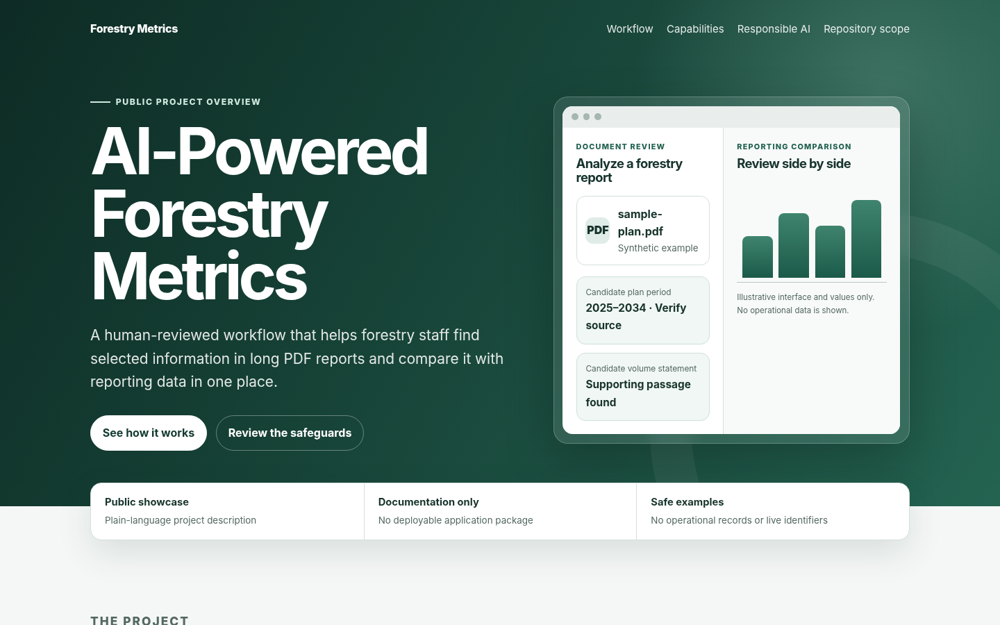
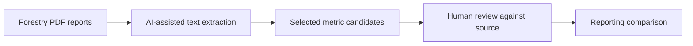

# AI-Powered Forestry Metrics

> **Public showcase · Documentation only · No operational data**

AI-Powered Forestry Metrics is a Microsoft Power Platform project that helps forestry staff find selected information in long PDF reports, review AI-assisted extractions, and compare the results with reporting data in one workflow.

The application is designed to reduce repetitive searching and copying while keeping people responsible for every final determination.



## What the project demonstrates

- A simple intake experience for forestry planning and inventory documents.
- AI-assisted identification of selected planning, volume, and allowable-cut information.
- A review step that keeps the source document central to the process.
- Embedded reporting for side-by-side comparison.
- A human-in-the-loop approach in which AI output is treated as a candidate result, not an official answer.

## How the concept works



1. A user selects an approved forestry PDF.
2. The workflow recognizes text and looks for selected metric categories.
3. Candidate results are displayed for review.
4. The reviewer checks the original document and compares the result with authorized reporting information.

## Why it matters

Forestry reports can be lengthy, and the same review process may require staff to search several documents, record values in separate notes, and move between systems. This project brings those tasks into a more consistent experience. It can reduce routine effort and make review easier to follow, but it does not replace professional judgment, policy, or source-document validation.

## Technology overview

| Technology | Public-level role |
|---|---|
| Microsoft Power Apps | User interface for document intake and result review |
| Microsoft Power Automate | Coordinates document processing and workflow steps |
| Microsoft AI Builder | Supports text recognition and candidate metric extraction |
| Microsoft Power BI | Presents reporting information for comparison |

Approved enterprise AI tools also assisted with iterative development and documentation. Human developers remained responsible for design decisions, testing, review, and release.

## What is included here

This repository contains only a public-safe project overview:

- This README
- A standalone project page in [`docs/index.html`](docs/index.html)
- A simplified workflow graphic
- Basic contribution and security guidance
- A publishing guide and public-release checklist

## What is intentionally not included

This repository does **not** contain:

- A Power Platform solution export or deployable application package
- Cloud-flow definitions, prompts, formulas, or connection references
- SharePoint, Power BI, tenant, workspace, report, environment, or list identifiers
- Production configuration or credentials
- Internal deployment instructions
- Operational forestry documents or extracted content
- Personal, tribal, controlled, or otherwise protected information
- Screenshots of live systems or real records

## View the public project page

Open [`docs/index.html`](docs/index.html) in a browser. The `docs` folder is also ready for GitHub Pages using the **Deploy from a branch** option.

Detailed publishing steps are in [`PUBLISHING.md`](PUBLISHING.md).

## Responsible AI

AI-generated output may be incomplete, inaccurate, or missing important context. Reviewers must verify every candidate value against the source document and applicable authoritative information before using it in official work.

Do not place source documents, extracted text, protected data, internal URLs, identifiers, or credentials in this repository or in public GitHub issues.

## Repository structure

```text
.
├── README.md
├── CONTRIBUTING.md
├── SECURITY.md
├── NOTICE.md
├── LICENSE_STATUS.md
├── PUBLISHING.md
├── PUBLIC_RELEASE_CHECKLIST.md
├── .github/
└── docs/
    ├── index.html
    └── assets/
```

## Project status

This repository is a public-facing description of a completed internal solution. It is not a supported deployment package or a substitute for an authorized technical release.

## License status

No open-source license has been assigned to this showcase. See [`LICENSE_STATUS.md`](LICENSE_STATUS.md) before copying or redistributing repository content.
